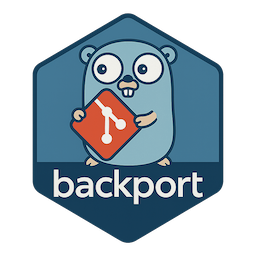

# backporter 

A CLI tool for backporting git commits and pull requests to target branches.

<p align="left">
  <a href="https://liberapay.com/pat-s"></a>&nbsp;&nbsp;
  <a href="https://liberapay.com/pat-s/donate"></a>
</p>

## Features

- Backport commits by SHA or pull requests by number
- Interactive mode with branch and PR selection
- CI mode for automatic backporting on PR merge
- Support for GitHub and Forgejo/Gitea forges
- Configurable target branches (supports regex patterns)
- Cache of backported commits/PRs for tracking
- Colored terminal output

## Installation

### Binary releases

Download the latest release from the [releases page](https://codefloe.com/pat-s/backporter/releases).

### Container image

```bash
docker pull codefloe.com/pat-s/backporter:latest
```

### From source

```bash
go install codefloe.com/pat-s/backporter/cmd/backporter@latest
```

### Via homebrew

```bash
brew tap pat-s/homebrew-tap https://codefloe.com/pat-s/homebrew-tap
brew install pat-s/tap/backporter
```

## Usage

### Interactive mode

Run without arguments to start the interactive wizard:

```bash
backporter
```

### Backport a commit

```bash
backporter backport commit <sha> <target-branch>

# Or directly with SHA:
backporter <sha> <target-branch>
```

### Backport a pull request

```bash
backporter backport pr <pr-number> <target-branch>

# Or directly with PR number:
backporter <pr-number> <target-branch>
```

### List backported items

```bash
backporter list
backporter list --clear  # Clear cache
```

### CI mode

Automatically backport merged PRs that have a label containing "backport":

```bash
backporter backport --ci
```

This command:

1. Reads the most recent commit on the current branch
2. Parses the PR number from the commit message
3. Checks if the PR has any label containing "backport"
4. If so, creates backport branches and PRs for all configured target branches

The backport PR title uses the conventional commit prefix from the original PR (e.g., `feat(api):` becomes `feat(api): backport #123 to release-1.x`). If no prefix is found, it defaults to `fix:`.

#### GitHub Actions

```yaml
name: Backport

on:
  pull_request:
    types: [closed]

jobs:
  backport:
    if: github.event.pull_request.merged == true
    runs-on: ubuntu-latest
    permissions:
      contents: write
      pull-requests: write
    steps:
      - uses: actions/checkout@v4
        with:
          fetch-depth: 0

      - uses: pat-s/backporter@v1
        with:
          token: ${{ secrets.GITHUB_TOKEN }}
```

#### Forgejo Actions

```yaml
name: Backport

on:
  pull_request:
    types: [closed]

jobs:
  backport:
    if: github.event.pull_request.merged == true
    runs-on: ubuntu-latest
    steps:
      - uses: actions/checkout@v4
        with:
          fetch-depth: 0
          token: ${{ secrets.FORGEJO_TOKEN }}

      - uses: codefloe.com/pat-s/backporter@v1
        with:
          token: ${{ secrets.FORGEJO_TOKEN }}
          forge-type: forgejo
          forgejo-url: https://codefloe.com
```

#### Crow CI

```yaml
# .crow/backport.yaml
when:
  - event: pull_request_merged

steps:
  backport:
    image: codefloe.com/pat-s/backporter:latest
    environment:
      FORGEJO_TOKEN:
        from_secret: forgejo_token
    commands:
      - git config --global --add safe.directory "$CI_WORKSPACE"
      - backporter backport --ci
```

#### Action Inputs

| Input            | Description                                    | Required | Default  |
| ---------------- | ---------------------------------------------- | -------- | -------- |
| `token`          | GitHub/Forgejo token with repo permissions     | Yes      | -        |
| `dry-run`        | Show what would be done without making changes | No       | `false`  |
| `forge-type`     | Forge type: `github` or `forgejo`              | No       | `github` |
| `forgejo-url`    | Forgejo instance URL (required for forgejo)    | No       | -        |
| `default-prefix` | Default conventional commit prefix             | No       | `fix`    |

Git user configuration (`user.name` and `user.email`) is auto-detected from the forge type if not already set.

## Configuration

Configuration can be set globally (`~/.config/backporter/config.yaml`) or per-repository (`.backporter.yaml`).

```yaml
# Forge type: "github" or "forgejo"
forge_type: forgejo

# Forgejo instance URL (only for forgejo)
# forgejo_url: https://codefloe.com

# Default target branches (supports regex)
target_branches:
  - release-1.x
  - release-2.x
  - stable

# Default branch to work from
default_branch: main

# Git remote name
remote: origin

# Number of recent PRs in interactive mode
recent_pr_count: 10

# Cache settings
cache:
  enabled: true
  path: '' # Defaults to ~/.cache/backporter/history.json

# CI mode settings
ci:
  default_prefix: fix # Conventional commit prefix when not detected from PR title
```

## Authentication

Set the appropriate environment variable for your forge:

```bash
# GitHub
export GITHUB_TOKEN=<your-token>

# Forgejo/Gitea
export FORGEJO_TOKEN=<your-token>
```

## Global options

| Option         | Description                       |
| -------------- | --------------------------------- |
| `--config, -c` | Path to config file               |
| `--remote`     | Git remote name (default: origin) |
| `--log-level`  | Logging level (default: info)     |
| `--pretty`     | Pretty-printed debug output       |
| `--nocolor`    | Disable colored output            |

## License

MIT
